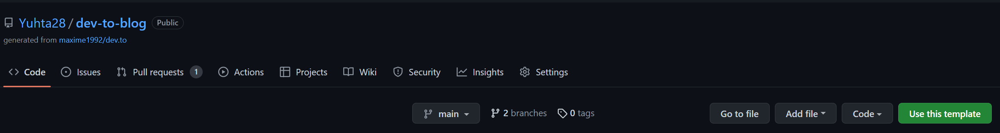
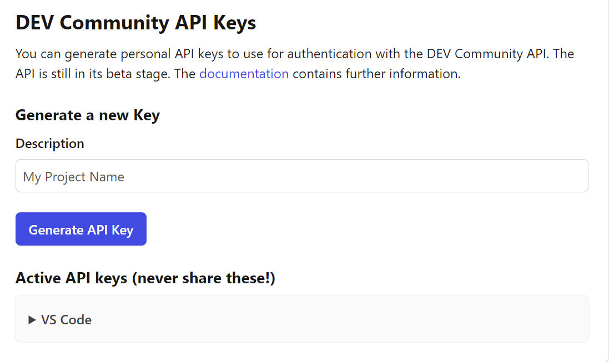
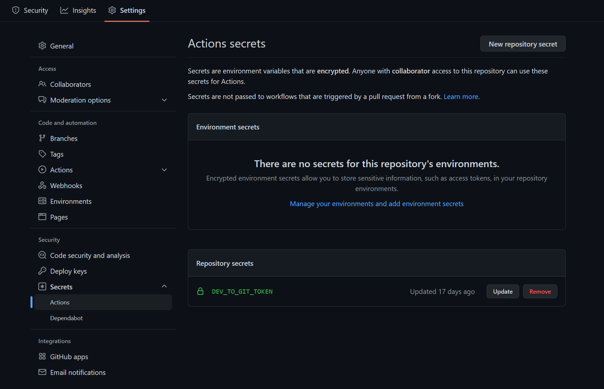
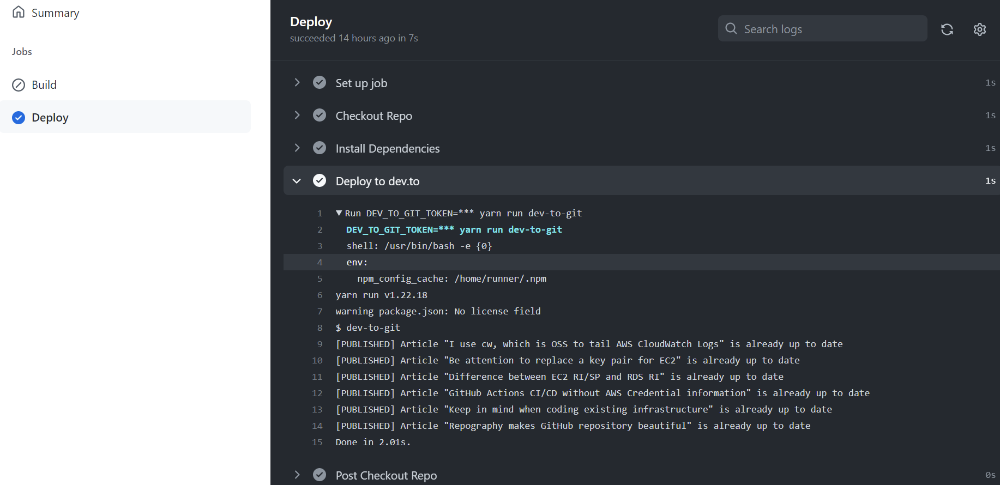

## Introduction

I blog in Japanese at [Zenn](https://zenn.dev/), community of engineers to help one another out. Zenn makes us able to manage our blogs in GitHub repository and to write articles in my favorite editor. In addition, I merge articles into main branch they would automatically be published to my blog with CI/CD.  
I wish that dev.to blog in the same way, and I realize that I manage my dev.to blog in GitHub repository and publish/update automatically it with reference to this article.  
https://dev.to/maxime1992/manage-your-dev-to-blog-posts-from-a-git-repo-and-use-continuous-deployment-to-auto-publish-update-them-143j

I implement GitHub Actions CI/CD with [DEV API](https://developers.forem.com/api). Based on above article, I introduce my own how to manage my dev.to blog.

## How to build

### 1. Copy the template

Go to the repository of article authors. https://github.com/maxime1992/dev.to and copy the template. 

### 2. Generate a DEV Community API key

Go to https://dev.to/settings/account and generate a DEV Community API key. 

### 3. Set the API Key to GitHub Actions

Go to GitHub repository copied from the template and set the API Key to Actions secrets. 

### 4. Build GitHub Actions workflow

In reference article, use [prettier](https://github.com/prettier/prettier) to format the markdown and the code snippets. I implement a text review using [textlint](https://github.com/textlint/textlint) and [reviewdog](https://github.com/reviewdog/reviewdog) in addition to that.

```yml
name: Build and Deploy

on:
  push:
    branches: [main]
  pull_request:

jobs:
  build:
    name: Build
    if: github.event_name == 'pull_request'
    runs-on: ubuntu-latest
    steps:
      - name: Checkout Repo
        uses: actions/checkout@master

      - name: Install reviewdog
        uses: reviewdog/action-setup@v1
        with:
          reviewdog_version: latest

      - name: Install Dependencies
        uses: bahmutov/npm-install@v1

        #Make sure that cache is retrieved even if steps fail
      - name: cache-node-modules
        uses: pat-s/always-upload-cache@v3
        env:
          cache-name: cache-node-modules
        with:
          path: ~/.npm
          key: node-${{ hashFiles('**/package-lock.json') }}
          restore-keys: |
            node-

      - name: Install textlint
        run: 'npm install --save-dev textlint textlint-rule-common-misspellings textlint-rule-spellchecker'

      - name: Run textlint
        run: npx textlint -f checkstyle "blog-posts/**/*.md" >> .textlint.log

      - name: Run reviewdog
        if: failure()
        env:
          REVIEWDOG_GITHUB_API_TOKEN: ${{ secrets.GITHUB_TOKEN }}
        run: |
          cat .textlint.log
          cat .textlint.log | reviewdog -f=checkstyle -name="textlint" -reporter="github-pr-review"

      - name: Run Prettier
        run: yarn run prettier:check

      - name: Run Embedme
        run: yarn run embedme:check

  deploy:
    name: Deploy
    if: github.ref == 'refs/heads/main' && github.event_name == 'push'
    runs-on: ubuntu-latest
    steps:
      - name: Checkout Repo
        uses: actions/checkout@master

      - name: Install Dependencies
        uses: bahmutov/npm-install@v1

      - name: Deploy to dev.to
        run: DEV_TO_GIT_TOKEN=${{ secrets.DEV_TO_GIT_TOKEN }} yarn run dev-to-git
```

### 5. Link GitHub with dev.to

Define a property `repository.url` in `package.json` and set it to the GitHub repository URL.

```json
  "name": "dev.to",
  "repository": {
    "type": "git",
    "url": "https://github.com/Yuhta28/dev-to-blog.git"
  }
```

### 6. Create new article

Create a template for a new article to use DEV API. `go run create-post.go`

```go
package main

import (
	"fmt"
	"io/ioutil"
	"log"
	"net/http"
	"os"
	"strings"
)

func main() {
	DEVAPIKEY := os.Getenv("DEVAPIKEY") //Set your dev.to API key in your environment variables
	client := &http.Client{}
	var data = strings.NewReader(`{"article":{"title":"Template","body_markdown":"Body","published":false,"tags":["tag1", "tag2"]}}`)
	req, err := http.NewRequest("POST", "https://dev.to/api/articles", data)
	if err != nil {
		log.Fatal(err)
	}
	req.Header.Set("Content-Type", "application/json")
	req.Header.Set("api-key", DEVAPIKEY)
	resp, err := client.Do(req)
	if err != nil {
		log.Fatal(err)
	}
	defer resp.Body.Close()
	bodyText, err := ioutil.ReadAll(resp.Body)
	if err != nil {
		log.Fatal(err)
	}
	fmt.Printf("%s\n", bodyText)
}
```

Unfortunately, the template cannot be connected to GitHub repository, so I need to get article ID and set it in `dev-to-git.json` to connect it to GitHub repository.

### 7. Set the article ID

Get the article ID to use DEV API, too. `go run get-blog-id.go`

```go
package main

import (
	"encoding/json"
	"fmt"
	"log"
	"net/http"
	"os"

	"github.com/itchyny/gojq"
)

func curl() interface{} {
	DEVAPIKEY := os.Getenv("DEVAPIKEY") //Set your dev.to API key in your environment variables
	client := &http.Client{}
	req, err := http.NewRequest("GET", "https://dev.to/api/articles/me/unpublished", nil)
	if err != nil {
		log.Fatal(err)
	}
	req.Header.Set("api-key", DEVAPIKEY)
	resp, err := client.Do(req)
	if err != nil {
		log.Fatal(err)
	}
	defer resp.Body.Close()
	var data interface{}
	err = json.NewDecoder(resp.Body).Decode(&data)
	if err != nil {
		log.Fatal(err)
	}
	return data
}

func main() {
	// Parse JSON
	query, err := gojq.Parse(".[].id")
	if err != nil {
		log.Fatalln(err)
	}
	input := curl()
	iter := query.Run(input) // or query.RunWithContext
	for {
		v, ok := iter.Next()
		if !ok {
			break
		}
		if err, ok := v.(error); ok {
			log.Fatalln(err)
		}
		fmt.Printf("%1.0f\n", v)
	}
}
```

### 8. Make the template for new article

Make the template for new article. `go run make-template.go`

```go
package main

import (
	"fmt"
	"os"
)

func main() {

	var blog string

	print("Enter the name of the new article: ")
	fmt.Scan(&blog)

	// Create blog directory
	if err := os.MkdirAll("blog-posts/"+blog, 0777); err != nil {
		fmt.Println(err)
	}
	_, err := os.Create("blog-posts/" + blog + "/" + blog + ".md")
	if err != nil {
		fmt.Println(err)
	}

	// Create code directory
	if err := os.MkdirAll("blog-posts/"+blog+"/code", 0777); err != nil {
		fmt.Println(err)
	}
	file_code, err := os.Create("blog-posts/" + blog + "/code/.gitkeep")
	if err != nil {
		fmt.Println(err)
	}
	defer file_code.Close()

	// Create assets directory
	if err := os.MkdirAll("blog-posts/"+blog+"/assets", 0777); err != nil {
		fmt.Println(err)
	}
	file_assets, err := os.Create("blog-posts/" + blog + "/assets/.gitkeep")
	if err != nil {
		fmt.Println(err)
	}
	defer file_assets.Close()
}
```

### 9. Link article ID with the template

Connect the article ID with the template into `dev-to-git.json`.

```json
[
  {
    "id": 773216,
    "relativePathToArticle": "./blog-posts/cw-oss-cloudwatch/i-use-cw-which-is-oss-to-tail-aws-cloudwatch-logs-2e9g.md"
  },
  {
    "id": 1056501,
    "relativePathToArticle": "./blog-posts/repography-make-readme-rich/repography-makes-github-repository-beautiful-3dn3.md"
  }
]
```

### 10. Deploy the article

It is completed to manage my dev.to blog in GitHub repository. After that, push branch and pull request to main branch, and run GitHub Actions CI/CD.



## Conclusion

I have managed my dev.to blog in GitHub repository. It makes me easy version control and I can write articles using my favorite editor(Visual Studio code). Moreover, the linter tool helps me to reduce careless mistakes in writing. So, let's try this method when writing articles in dev.to.

## Original

https://zenn.dev/yuta28/articles/dev-github-vscode

## References

https://dev.to/maxime1992/manage-your-dev-to-blog-posts-from-a-git-repo-and-use-continuous-deployment-to-auto-publish-update-them-143j https://dev.to/beeman/automate-your-dev-posts-using-github-actions-4hp3
