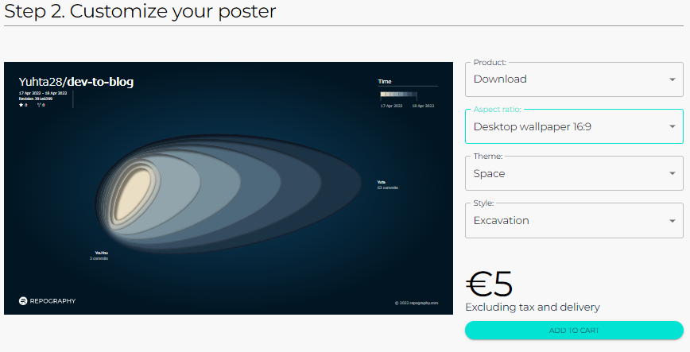
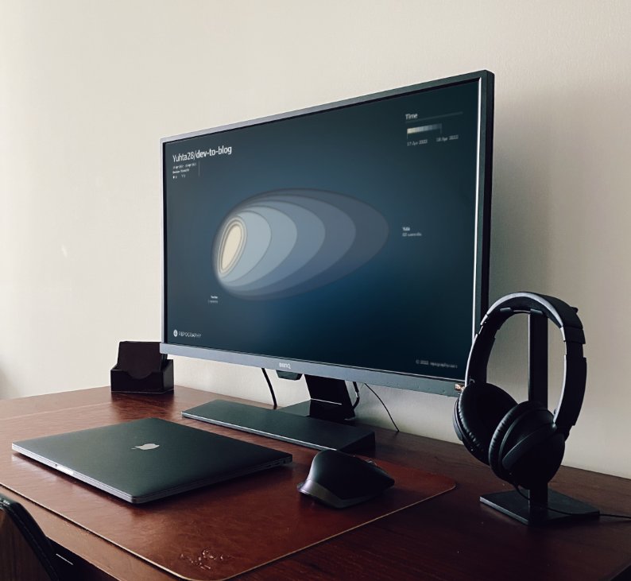

## Introduction

GitHub provides a GitHub Apps service that allows you to access various applications. We can gain some exciting Apps from [GitHub marketplace](https://github.com/marketplace). I introduce an exciting App called Repography that visualizes commits to GitHub repositories and enriches `README.md`.

## What's Repography?

https://github.com/marketplace/repography

Repography is a GitHub App that provides visualized dashboard in markdown format for GitHub repositories. You embed it in `README.md` and the dashboard will be displayed in your repository to see past commits, issues, and ranking of top contributors. Access [the site of Repography](https://repography.com/) and can experience demo of Repography embedded OSS repository. 

- [clap](https://github.com/clap-rs/clap)
- [neovim](https://github.com/neovim/neovim)
- [strawberry](https://github.com/strawberry-graphql/strawberry)
- [xdebug](https://github.com/xdebug/xdebug)

Click on the OSS installed Repography repository and Repography output the information for that OSS to the dashboard.

##  / Recent activity 

    

##  / Structure

##  / Top contributors

Repography offers several fee plans. These plans are no difference in functionally, only an increase in the private repository limit.  

Choose your repository you wish to link to Repography and the dashboard display. 

You can choose either markdown or reStructuredText from the format on the right. Copy code, embed it in `README.md`, and the dashboard will be displayed in your repository.

## Poster

Repography provides another unique feature. It is that Repography output can be displayed in the office as a poster.  

The fee is €60, but I don't know if they will ship overseas. Fortunately, You can download the PNG file. 

Now you can have your posters printed print local print stores, even if you live far away. Also, you install the 4K desktop wallpaper (16:9). Stick it on your PC and make it a memory. 

## Conclusion

I introduced Repography. It visualizes the amount of your commitments on the dashboard, so if you introduce it to your daily learning motivation or when developing OSS with your team, it may help improve your motivation as you can visualize your hard work.

The poster would also be perfect for a stylish tech company office, so companies that are interested should consider it💡

## Original

https://zenn.dev/yuta28/articles/repography-handson
